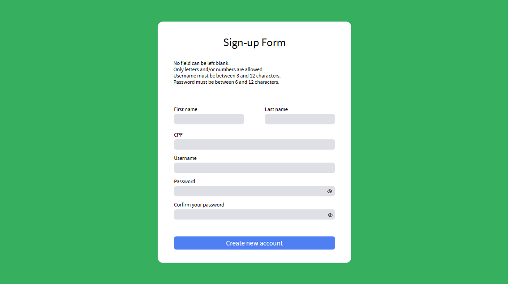

# Guia de estilazação do site:

- [Design](#deseign-da-página);
- [Cores](#cores);
- [Fontes](#fontes);
- [Portabilidade](#portabilidade);

## DESEIGN DA PÁGINA

## CORES:

- blue-500: hsla(225, 91%, 64%, 1.00);
- green-350: hsla(144, 71%, 49%, 0.81); 
- gray-300: hsla(230, 10%, 89%, 1.00);

## FONTES:

- font: Open Sans;
- weight: 400, 500 e 700;

## PORTABILIDADE:

- Desktop: 1440px;
- Mobile: 320px;
